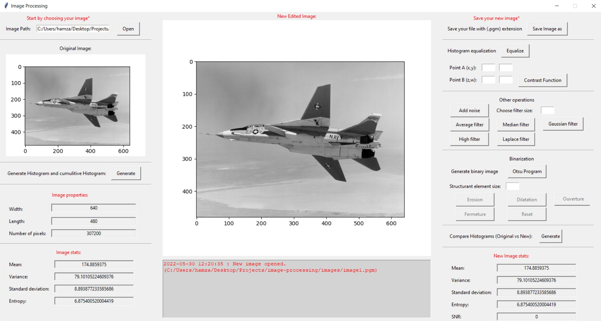

<!-- PROJECT LOGO -->
<div align="center">
  <h3 align="center">Image processing Tool</h3>
  <p align="center">
    Build with python
  </p>
</div>


<!-- TABLE OF CONTENTS -->
<details>
  <summary>Table of Contents</summary>
  <ol>
    <li>
      <a href="#about-the-project">About The Project</a>
      <ul>
        <li><a href="#built-with">Built With</a></li>
      </ul>
    </li>
    <li>
      <a href="#getting-started">Getting Started</a>
      <ul>
        <li><a href="#prerequisites">Prerequisites</a></li>
        <li><a href="#installation">Installation</a></li>
      </ul>
    </li>
    <li><a href="#usage">Usage</a></li>
    <li><a href="#contact">Contact</a></li>
    <li><a href="#acknowledgments">Acknowledgments</a></li>
  </ol>
</details>


<!-- ABOUT THE PROJECT -->
## About The Project

This Porject represents an **Image Porcessing tools** using python to read and manipulate images in `pgm` format.  
**PGM** is a standard bitmap based format consisting of a 4 lines header, and data stored in the unsigned char type, providing a maximum of 256 gray scale levels or 8-bit data per pixel.  
The application main features are:
- Reading a pgm file wether in `ASCII` or `Binary` format.
- Save an edited image in `ASCII` format.
- Display different statistical variables about the image (pixels,mean,variance...).
- Generate image histograms.
- Change image contrast.
- Add and filter noise using different filters (Median filter, laplace filter ...).

<p align="right">(<a href="#top">back to top</a>)</p>


### Built With

* [Python](https://www.python.org/)
* [Jupyter](https://jupyter.org/)
* [Tkinter](https://docs.python.org/fr/3/library/tkinter.html)
* [VSCode](https://code.visualstudio.com/)

<p align="right">(<a href="#top">back to top</a>)</p>


<!-- GETTING STARTED -->
## Getting Started

### Prerequisites

You need to have `python` installed and `jupyter` configured on your system(use the **link provided above**).

### Installation

Clone the repo
   ```sh
   git clone https://github.com/hamza-mahjoub/image-processing.git
   ```

<p align="right">(<a href="#top">back to top</a>)</p>


<!-- USAGE EXAMPLES -->
## Usage

This project contain 2 main files which are `app.ipynb` and `main.py` under interfaces.
**app.ipynb** contains all implemented features without an interface(you can visualize the results on the github).
**main.py** is the entry point of the interface below.


<p align="right">(<a href="#top">back to top</a>)</p>


<!-- CONTRIBUTING -->
## Contributing

If you have a suggestion that would make this better, please fork the repo and create a pull request. You can also simply open an issue with the tag "enhancement".
Don't forget to give the project a star! Thanks again!

1. Fork the Project
2. Create your Feature Branch (`git checkout -b feature/AmazingFeature`)
3. Commit your Changes (`git commit -m 'Add some AmazingFeature'`)
4. Push to the Branch (`git push origin feature/AmazingFeature`)
5. Open a Pull Request

<p align="right">(<a href="#top">back to top</a>)</p>


<!-- CONTACT -->
## Contact

Hamza Mahjoub - mahjoubhamza036@gmail.com

Project Link: [https://github.com/hamza-mahjoub/image-processing.git](https://github.com/hamza-mahjoub/image-processing.git)

<p align="right">(<a href="#top">back to top</a>)</p>


<!-- ACKNOWLEDGMENTS -->
## Acknowledgments

* [Melek Elloumi image processing tool](https://github.com/MelekElloumi/Image-Processing-Tool.git)

<p align="right">(<a href="#top">back to top</a>)</p>

